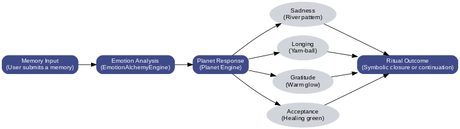

# Cloudtail — Ritual Sandbox for Pet Loss (Demo Build)

Unity front-end + FastAPI backend delivering a ritualized, symbolic sandbox for pet bereavement. Emphasis on **reproducibility**, **transparent limitations**, and **assessor-friendly** documentation.

---

## Repository Structure

```text
/ (root)
├─ backend/
│  └─ cloudtail_backend/
│     └─ docs/                   # Poster, API notes, images live here
├─ Assets/                       # Unity project assets (demo scene, UI, scripts)
└─ README.md                     # This file
```

> Demo scene path: `Assets/Scenes/SampleScene.unity`.

---

## Visual Overview



- Poster (PDF): [`backend/cloudtail_backend/docs/Poster_siqi_wu.pdf`](backend/cloudtail_backend/docs/Poster_siqi_wu.pdf)

---

## Requirements

- Windows 10/11 or macOS
- Python **3.10–3.12** (virtual environment recommended)
- Unity **2022+** with TextMeshPro and the **Input System**

Optional (CPU-only backends that need Torch):
```bash
pip install --index-url https://download.pytorch.org/whl/cpu torch
```

---

## Profiles & Ports

| Profile      | Port | Purpose                                    |
|--------------|------|--------------------------------------------|
| presentation | 8020 | Minimal demo set for recording             |
| full         | 8010 | Includes `/api/memories/*` for measurement |

Health check: `GET /healthz` → `{"profile":"presentation"|"full"}`.

---

## Quickstart: Backend

**Windows (PowerShell)**
```powershell
# Presentation (demo)
cd backend
$env:CLOUDTAIL_PROFILE = "presentation"
python -m uvicorn --app-dir . cloudtail_backend.main:app --host 127.0.0.1 --port 8020 --reload
```

```powershell
# Full (measurement)
cd backend
$env:CLOUDTAIL_PROFILE = "full"
python -m uvicorn --app-dir . cloudtail_backend.main:app --host 127.0.0.1 --port 8010 --reload
```

**macOS / Linux**
```bash
# Presentation (demo)
cd backend
CLOUDTAIL_PROFILE=presentation uvicorn cloudtail_backend.main:app --host 127.0.0.1 --port 8020 --reload
```

```bash
# Full (measurement)
cd backend
CLOUDTAIL_PROFILE=full uvicorn cloudtail_backend.main:app --host 127.0.0.1 --port 8010 --reload
```

Swagger: `http://127.0.0.1:8020/docs` (presentation), `http://127.0.0.1:8010/docs` (full)

---

## Unity Integration (Minimal)

1. Open `Assets/Scenes/SampleScene.unity`.
2. Add a GameObject (e.g., **CloudtailAPI**) and attach `CloudtailApiClient` (included).
3. In the Inspector:
   - **Base Url** = `http://127.0.0.1:8020` (presentation) or `http://127.0.0.1:8010` (full).
   - Assign a `TMP_InputField` for user text.
   - *(Optional)* assign a `TextMeshProUGUI` for inline logs.
   - *(Optional)* assign planet GameObjects named by keys: `ambered`, `rippled`, `spiral`, `woven`.
4. Trigger sending:
   - Bind **OnEndEdit → CloudtailApiClient.Send()**, or
   - Bind a Button’s **OnClick → CloudtailApiClient.Send()**.
5. Enter Play mode → type → submit → the theme/planet responds to backend results.

> Keep a single submit trigger to avoid duplicate requests. Ensure a single **EventSystem** using the **Input System UI Input Module**.

---

## Demo Workflow (≈20 s recording)

**Unity (primary shot)**
1. Enter a safe line (see below) → submit.
2. Observe color/theme change and the corresponding planet GameObject activation.

**Backend proof (optional)**
- In Swagger, call **GET `/planet/status`** to show a valid 200-OK payload.

**Safe inputs (current build)**
- Gratitude → `Thank you for the evenings`
- Sadness → `It still hurts sometimes`
- Edge case → `missyou!!!` (demonstrates robustness limits)

---

## API Surface Used by the Demo

- **POST** `/api/recommend` → `{ planet_key, display_name, emotion, confidence, reason, ... }`  
  **Field semantics (request body)**  
  - `content` (**required**): user-provided raw text (free text).  
  - `text` *(optional)*: pre-normalized text (e.g., whitespace collapse, punctuation compression, aliasing such as `miss u|missyou → miss you`).  
  - **Current build behavior**: clients **SHOULD** send `content`; including `text` is optional. Sending **both** is compatible and recommended.

  **Example payload**
  ```json
  { "content": "I still remember the sunset", "text": "I still remember the sunset" }
  ```

- **GET** `/planet/status` → current planet state (used by the demo UI)
- **GET** `/healthz` → liveness + active profile
- `/api/memories/*` (full only) → CRUD for memory entries

**Full API reference**: `backend/cloudtail_backend/docs/backend_api.md`

---

## Reproducibility

- Procedural notes and the ten-probe snapshot:  
  **[`backend/cloudtail_backend/docs/Reproducibility.md`](backend/cloudtail_backend/docs/Reproducibility.md)**  
  Artifacts: **`backend/cloudtail_backend/docs/probe_results.md`**, **`backend/cloudtail_backend/docs/probe_results.csv`**

**Environment fingerprint (record with submission)**
```bash
python -V
git rev-parse --short HEAD
```

---

## Current Behavior (Snapshot)

- Classifier targets **four canonical emotions**: **sadness, guilt, nostalgia (longing), gratitude**.
- Over the current build and probe set, outputs predominantly surface **gratitude / sadness / guilt**; **nostalgia (longing)** is frequently absorbed into **gratitude**.
- Mapping **aggregates multiple emotions to `planet_key = ambered`** in this build.
- One-to-one mapping and regression testing are planned post-submission.

---

## Known Limitations → Practical Notes

- **Emotion→Planet aggregation**: multiple emotions may map to `ambered`. Treat as configuration of the demo build; restore 1:1 mapping after submission.
- **Nostalgia (longing) absorption**: nostalgia/longing forms are often mapped into gratitude in this build; document as a limitation for the demo profile.
- **Longing vs. Gratitude phrasing**: English forms containing *long/yearn/peace/thank* can skew positive.
- **Edge/degraded input**: tokens like `missyou!!!` may trigger `guilt → rippled`; use as a controlled edge-case in demos.
- **Mixed language**: multilingual lines reduce confidence; single-language short inputs are more stable.

**Near-term plan (post-submission)**
- Restore **one-to-one** emotion→planet mapping (e.g., `sadness → rippled`, `guilt → spiral`, `nostalgia → woven`, `gratitude → ambered`).  
- Address nostalgia (longing) absorption by strengthening the nostalgia classifier and alias set.  
- Ship a minimal client-side normalization toggle (whitespace collapse, punctuation compression, `miss u|missyou → miss you`).  
- Add regression suite: 4×N probe grid + confusion matrix across profiles.

---

## Troubleshooting

- `/api/memories/*` absent in Swagger → running in `presentation` profile (expected). Use `full` or switch to `:8010`.
- All responses look identical → request likely sent to the presentation port (:8020) or the body field name not read; include `"content"` (and optionally `"text"`).
- Swagger not sending → click **Try it out** before **Execute**.
- Port/profile confusion → confirm via `GET /healthz`.

---

## Ethics & Scope

Prototype for symbolic reflection; **not** a diagnostic or therapeutic tool. In presentation mode, personal input is not persisted. Limitations and potential biases are disclosed in documentation and demos.

---

## License

Academic/demo use.
