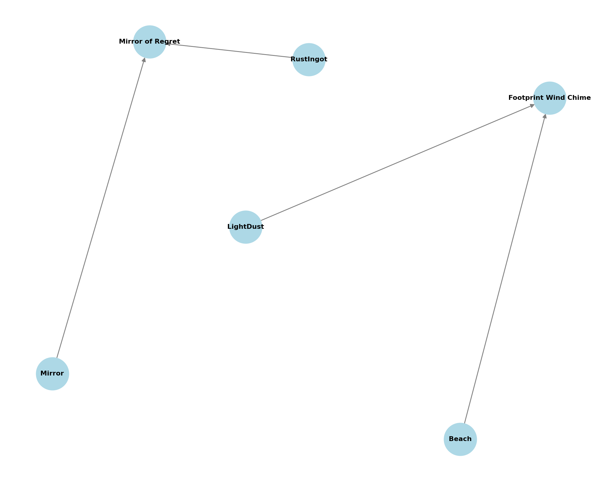

# 📘 Cloudtail Data Schemas Reference

> This document outlines the core configuration schemas used in the Cloudtail backend system. These data models define the structure of emotional crafting, ritual templates, and symbolic mappings that power the grief ritual engine.

---

## 📚 Table of Contents

1. [Emotion Mapping Schema](#1-emotion-mapping-schema)
2. [Crafted Items Schema](#2-crafted-items-schema)
3. [Ritual Templates Overview](#3-ritual-templates-overview)
4. [Planet State Configuration](#4-planet-state-configuration)
5. [Visual Dependency Graph](#5-visual-dependency-graph)

---

## 1. Emotion Mapping Schema

Each primary emotion (e.g., `grief`, `nostalgia`) maps to a symbolic element and an intensity-based material.

```json
"emotion_map": {
  "grief": {
    "element": "CrystalShard",
    "materials": ["AshDust", "StoneFragment"]
  },
  "nostalgia": {
    "element": "EchoBloom",
    "materials": ["MemoryPetal", "FadedInk"]
  }
}
```

### 🔍 Purpose:
Used in the EmotionAlchemyEngine to translate emotional text into symbolic crafting ingredients.

### 🧪 Example:
> A memory tagged as `nostalgia` → maps to `EchoBloom`, contributes to crafting `Echo Lantern`.

---

## 2. Crafted Items Schema

Specifies symbolic items that can be synthesized from emotional elements and materials.

```json
"crafted_items": {
  "Echo Lantern": ["EchoBloom", "MemoryPetal"],
  "Phoenix Pearl": ["CrystalShard", "AshDust"]
}
```

### 🔨 Usage:
- Item synthesis in `/craft/` endpoint
- Ritual enhancements or token generation

### 🧪 Example:
```json
{
  "type": "nostalgia",
  "element": "EchoBloom"
}
```
→ May unlock: `Echo Lantern`
You can preview all craftable items via the `GET /craft/preview` endpoint, which shows one possible result per defined emotion type. This helps users explore what their memories *could* become.
---

## 3. Ritual Templates Overview

Rituals are predefined scripts structured around emotional pathways and current planetary grief states.

```json
{
  "ritual_id": "ashes_to_light",
  "ritual_type": "rebirth",
  "emotion_path": ["grief", "nostalgia", "hope"],
  "required_state": "rebirth",
  "script": [
    { "action": "burn", "object": "memory_shard", "line": "Let it become ash." },
    { "action": "scatter", "object": "ash", "line": "To the winds of remembrance." },
    { "action": "ignite", "object": "sky_flame", "line": "Light the path forward." }
  ]
}
```

### 🔍 Key Fields:
- `emotion_path`: Emotions required to trigger this ritual
- `required_state`: Planetary grief state (e.g., `rebirth`, `neutral`)
- `ritual_type`: Optional grouping (e.g., `rebirth`, `honor`, `release`)

### 🧪 Example Response from `/rituals/perform`:
```json
{
  "ritual_id": "echo_bloom",
  "script": [...],
  "effect_tags": ["remembrance", "growth"]
}
```

---

## 4. Planet State Configuration

Dynamically derived from recent emotions; maps to visual and functional states of the grief planet.

```json
{
  "state_tag": "grief",
  "dominant_emotion": "grief",
  "color_palette": ["#3E3E72", "#5B5B99"],
  "visual_theme": "ashen"
}
```

### 🔍 Derived From:
- Recent memory entries (`detected_emotion` or `manual_override`)
- Evaluated via `infer_planet_state()` in `planet_engine.py`

---

## 5. Visual Dependency Graph

The following diagram illustrates symbolic dependencies between emotional elements and crafted items.


graph LR
    EchoBloom --> EchoLantern
    MemoryPetal --> EchoLantern
    CrystalShard --> PhoenixPearl
    AshDust --> PhoenixPearl


---

## 🧩 Notes

- All configurations reside under `storage/cloudtail_config.json`
- Modular structure supports external expansion (e.g., new ritual types)
- Schemas are loaded at runtime; changes require server restart to take effect

---

*Made with memory threads and ritual syntax 🌱*

