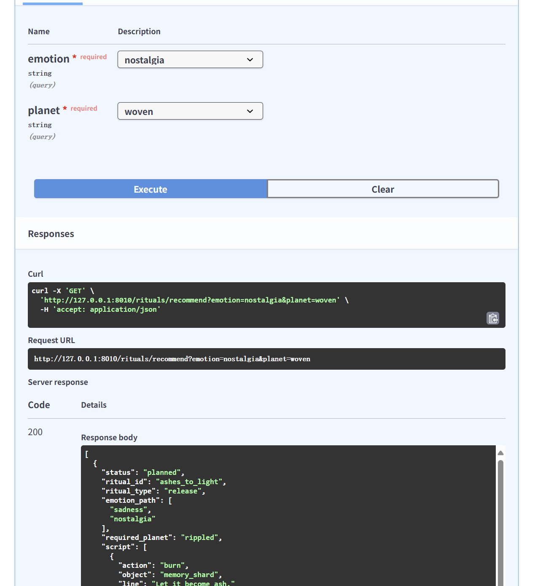

# Cloudtail Backend API Reference (Concise)

FastAPI service for the Unity demo. Converts free-text memories to **four canonical emotions**, maps them to **four planets**, and exposes poster-aligned **demo stubs** for Ritual & Crafting.

All responses are JSON. Errors follow standard HTTP status semantics.

---

## Profiles

| Profile      | Port | Routes |
|--------------|------|--------|
| presentation | 8020 | `/api/recommend`, `/planet/status`, `/rituals/*` (stub), `/craft/*` (stub), `/healthz` |
| full         | 8010 | All of the above **+** `/api/memories/*` |

Note: `/api/memories/*` is **visible only** in the `full` profile (8010). It is hidden in `presentation` (8020).

---

## Canonical Contract

- **Emotions**: `sadness`, `guilt`, `nostalgia (longing)`, `gratitude`  
  (aliases are canonicalized; e.g., `grief/sorrow  → sadness`, `acceptance/peace/hope/joy/love  → gratitude`)
- **Planets**: `rippled` (sadness), `spiral` (guilt), `woven` (nostalgia), `ambered` (gratitude)

---

## Recommendation

### POST `/api/recommend`  — one-step mapping to `(emotion, planet_key)`

**Request**
- Content-Type: `application/json`
- **Field semantics**
  - `content` (**required**): user-provided raw text (free text).
  - `text` *(optional)*: pre-normalized text (e.g., whitespace collapse, punctuation compression, aliasing such as `miss u|missyou  → miss you`).
  - **Current build**: clients **SHOULD** send `content`; including `text` is optional. Sending **both** is compatible and recommended.

**Example**
```json
{ "content": "I still remember the sunset", "text": "I still remember the sunset" }
```

**Response (current build example)**
```json
{
  "planet_index": 0,
  "planet_key": "ambered",
  "display_name": "Ambered Haven",
  "emotion": "gratitude",
  "confidence": 0.93,
  "reason": "Engine -> ambered",
  "essence": {
    "internal": "gratitude",
    "element": "LightDust",
    "tags": ["healing", "ambient"],
    "raw_value": 0.93
  }
}
```

---

## Planet State

### GET `/planet/status`  — current planet state for the demo UI

Returns a preview/default in `presentation`, and a history-derived state in `full`.

**Example**
```json
{
  "dominant_emotion": "nostalgia",
  "planet_key": "woven",
  "color_palette": ["#B9A3D0", "#D3C7E6"],
  "visual_theme": "mist",
  "last_updated": "2025-09-18T12:31:40Z"
}
```

---

## Memories (full profile)

### POST `/api/memories/`  — upload a memory
```json
{ "content": "She used to curl up by my feet every night." }
```

**Response (MemoryEntry)**
```json
{
  "id": "uuid",
  "content": "She used to curl up by my feet every night.",
  "timestamp": "2025-09-18T12:30:10Z",
  "detected_emotion": "nostalgia",
  "manual_override": null,
  "is_private": false,
  "keywords": []
}
```

**Notes**
- Detected labels are canonicalized to the four.
- `manual_override` (if set) takes precedence on read.

### GET `/api/memories/`  — list memories
Returns an array of `MemoryEntry`.

### PATCH `/api/memories/{memory_id}`  — update memory
Partial updates allowed (e.g., `manual_override`, `is_private`, `keywords`).

---

## Crafting (poster-aligned demo stubs)

### POST `/craft/`  — craft symbolic item (stub)
```json
{ "emotion_type": "nostalgia" }
```
```json
{
  "status": "planned",
  "item_name": "Echo Lantern",
  "element": "EchoBloom",
  "materials_used": ["MemoryPetal"],
  "effect_tags": ["symbolic", "nostalgia"],
  "description": "A symbolic item crafted from nostalgia (demo stub)."
}
```

### GET `/craft/preview`  — preview items (stub)
Returns an array of preview artifacts for the four emotions (status `"planned"`).

---

## Rituals (poster-aligned demo stubs)

### GET `/rituals/perform`  — one ritual (stub)
Returns a deterministic ritual descriptor (status `"planned"`).

### GET `/rituals/recommend`  — list rituals (stub)
**Response shape (demo stub)**  — returns an **array** of ritual descriptors (deterministic). Example:
```json
[
  { "id": "ritual.sample.001", "title": "Evening Light", "status": "planned" },
  { "id": "ritual.sample.002", "title": "River Stones",   "status": "planned" }
]
```
**Response (example, array)**




---

## Health

### GET `/healthz`
```json
{ "ok": true, "profile": "presentation" }
```

---

## Error Conventions

- Non-2xx HTTP codes with JSON bodies: `{ "detail": "...", "error_code": "..." }` (shape may vary by route).
- Empty/invalid body on `/api/recommend` in presentation may fall back to a safe preview; for measurement use the full profile.


